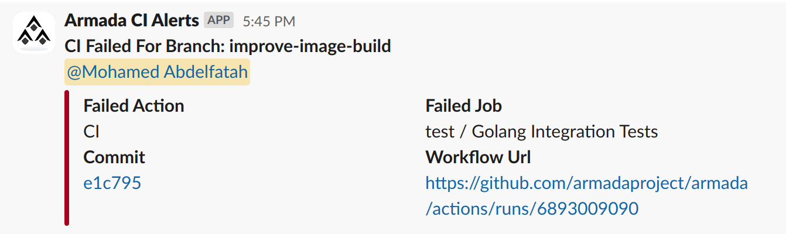

## CI Alerts

a simple action to customize Slack alerts for CI failures using Slack [Webhooks](https://api.slack.com/messaging/webhooks). Simply, the action will send a message to a slack channel when a CI job fails in two cases: 

- If the job is triggered by a pull_request AND the author of the PR is in the `users_path` file, the author will be mentioned in the message. the message will be as the following:



- If the job is triggered by a push to the `master` branch, the message will be sent to the channel with mentioning the channel.

## Usage Example
```yaml
name: Slack CI Alerts

on:
  workflow_run:
    workflows: [Test, Build, ...]
    types: [completed]

jobs:
  on-failure:
    runs-on: ubuntu-latest
    if: github.event.workflow_run.conclusion == 'failure' 
    steps:
      - uses: actions/checkout@v3.3.0
      - name: "Send Notification"
        uses: armadaproject/ci-alerts@v1
        env: 
          webhook: ${{ secrets.SLACK_WEBHOOK }}
          github_context: ${{ toJSON(github) }}
          users_path: ${{github.workspace}}/.github/gh-to-slackid
```
### Environment Variables
- `webhook`: the slack webhook url. [see more](https://api.slack.com/messaging/webhooks).
- `github_context`: the github context. you can get it from `${{ toJSON(github) }}`.
- `users_path`: the path to the file that contains the mapping from a github username to a slack [client id](https://api.slack.com/authentication/best-practices#client-id) so the author can be mentioned in the message. If the author doesn't exist in the file, no message will be sent to the slack channel.

The format of the file should be as :
```
github-username:slack-id
```
